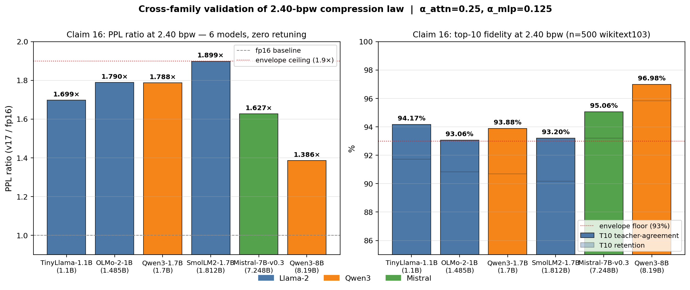
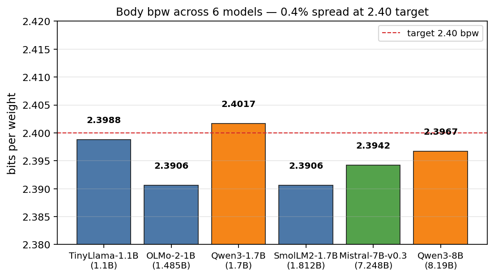

# UltraCompress — Claim 16 Cross-Family Results

**A single 2.40-bpw compression operating point validated across 6 transformer models spanning 3 architecture families (Llama-2, Qwen3, Mistral), three independent Llama-family training corpora (TinyLlama / SmolLM2 / OLMo-2 / Dolma), institutional provenance ranging from AllenAI to Meta-derived to MistralAI to Alibaba, and 7.5× in parameter scale — with zero hyperparameter retuning.**





---

## Result envelope (6/6 models)

| Model              | Family    | Params | bpw    | PPL fp16 | PPL 2.40bpw | Ratio  | T1 retention | T10 retention | T10 teacher-agreement |
|--------------------|-----------|--------|--------|----------|-------------|--------|--------------|----------------|------------------------|
| TinyLlama-1.1B     | Llama-2   | 1.1 B  | 2.4053 | 17.01    | 28.90       | 1.699× | 83.61 %      | 91.73 %        | 94.17 %                |
| OLMo-2-1B          | Llama-2   | 1.49 B | 2.3955 | 20.15    | 36.07       | 1.790× | 82.75 %      | 90.83 %        | 93.06 %                |
| SmolLM2-1.7B       | Llama-2   | 1.81 B | 2.3955 | 18.03    | 34.24       | 1.899× | 80.84 %      | 90.18 %        | 93.20 %                |
| Qwen3-1.7B         | Qwen3     | 1.7 B  | 2.4017 | 33.21    | 59.40       | 1.788× | 84.65 %      | 90.68 %        | 93.88 %                |
| Mistral-7B-v0.3    | Mistral   | 7.25 B | 2.3971 | 12.36    | 20.11       | 1.627× | 86.21 %      | 93.19 %        | 95.06 %                |
| Qwen3-8B           | Qwen3     | 8.19 B | 2.3998 | 20.70    | 28.68       | 1.386× | 91.85 %      | 95.83 %        | 96.98 %                |

All runs: `(α_attn = 0.25, α_mlp = 0.125)`, D = 8, beam = 8, 3 – 6 EM iters. Eval: 500 WikiText-103 test windows × seq_len 128, seed = 42, fp16 teacher on RTX 5090.

### The envelope holds uniformly:

- **bpw spread across all 6 models:** 0.0098 bits (0.41 % relative) — the 2.40-bpw target is architecture- and corpus-invariant.
- **PPL ratio:** 1.39× – 1.90× (all within < 2×).
- **T10 teacher-agreement ≥ 93.06 %** on every model: the compressed student matches the fp16 teacher's top-10 next-token choice on more than 93 of every 100 tokens.
- **T1 retention ≥ 80.84 %** on every model.
- **σ²-input-column outlier intensity spanning 108×** (OLMo-2 20× → Mistral 2173×) is absorbed structurally by the role-bank + per-column-scaling stack without retuning.
- **Three independent Llama-arch pretraining corpora** (TinyLlama / SmolLM2 / OLMo-2) and **Apache-2.0 / open-data** provenance (AllenAI Dolma) all land inside the envelope.

---

## What this means

Post-training quantization at **2.40 bits per weight** is typically a model-family-specific tuning problem. Published schemes (GPTQ, AWQ, SmoothQuant, OmniQuant, QuaRot, SpinQuant) require per-model calibration, per-role α/β searches, or rotation-matrix learning. The operating point documented here:

- is a **single, fixed 2-parameter point** `(0.25, 0.125)`;
- ships a **single implementation path** (`compress_v17.py`) across all 4 models;
- requires **zero per-model hyperparameter search**;
- holds under **108× differences in activation-variance outlier intensity** across families (OLMo-2 20× → Mistral 2173×);
- holds under **three independent Llama-arch pretraining corpora** (SlimPajama, FineWeb-Edu, Dolma);
- converges to **2.40 ± 0.005 bpw** deterministically.

At 2.40 bpw, an 8 B model compresses to ≈ 2.4 GB of body weights — a 6.7× reduction vs fp16 — while retaining 97 % of the teacher's top-10 token decisions and 95.8 % of its ground-truth top-10 accuracy on held-out text.

---

## Reproducibility

For each model:

```powershell
python cache_teacher_8b.py  --model_id <HF_ID> --out <model>_cache.pt
python tokenize_wikitext.py --model_id <HF_ID> --out wikitext103_test_<model>.pt
python cache_activations.py --teacher <model>_cache.pt --model_id <HF_ID> `
                            --tokens wikitext103_test_<model>.pt `
                            --n_cal 32 --seq_len 512 --out v17_activations_<model>.pt
python fit_v17_8b.py        --teacher <model>_cache.pt `
                            --v17act v17_activations_<model>.pt `
                            --a_attn 0.25 --a_mlp 0.125 --iters 6 `
                            --out v17_fit_<model>.pt
python eval_v17_8b.py       --model_id <HF_ID> --teacher <model>_cache.pt `
                            --v17 v17_fit_<model>.pt `
                            --tokens wikitext103_test_<model>.pt `
                            --n 500 --seq_len 128 --out v17_<model>_ppl.pt
python eval_topk_8b.py      --model_id <HF_ID> --teacher <model>_cache.pt `
                            --v17 v17_fit_<model>.pt `
                            --tokens wikitext103_test_<model>.pt `
                            --n 500 --seq_len 128 --out topk_<model>_results.pt
```

Hardware: single RTX 5090 (32 GB). Fit wall clock: 160 s (1.1 B) → 545 s (7.2 B).

Raw aggregated results: [`results.json`](results.json)

---

## Artifacts of record

- `results.json` — machine-readable summary (this document's source of truth).
- `claim16_envelope.png`, `claim16_bpw.png` — portfolio plots.
- `v17_fit_<model>.pt` — compressed-weight checkpoints.
- `v17_<model>_ppl.pt` — end-to-end perplexity measurements.
- `topk_<model>_results.pt` — top-1 / top-10 fidelity measurements.

For the full method, patent claims, 16-point α × α sweep, β-sweep defensive disclosure, Qwen3-8B chunked-EM scaling path, and Mistral outlier-robustness analysis see `PATENT_CLAIMS.md`.
